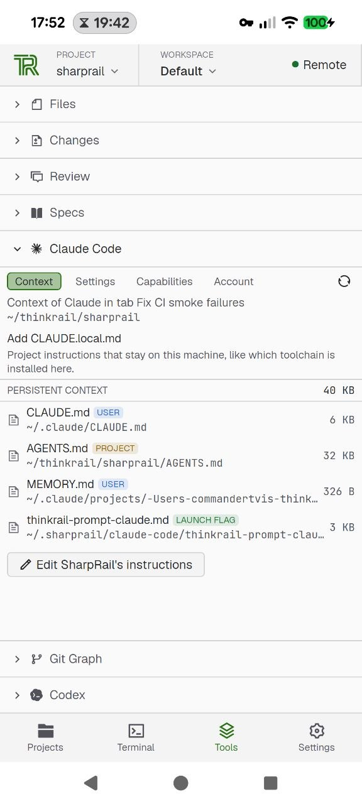
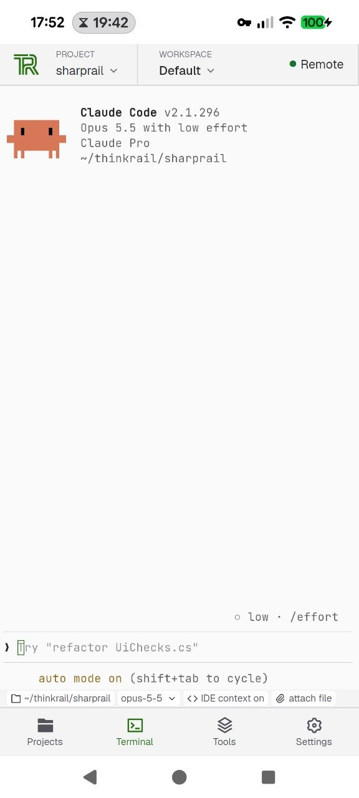
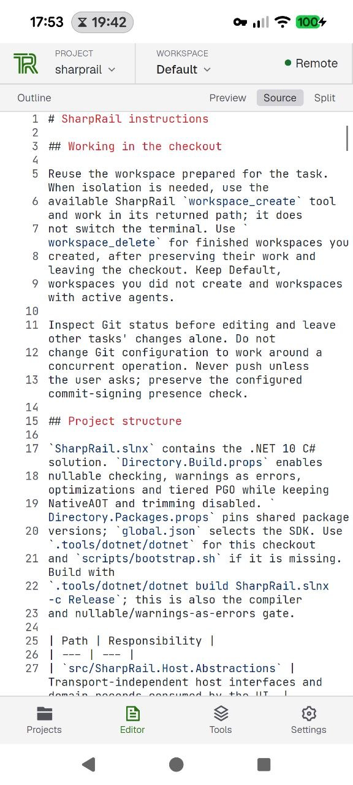
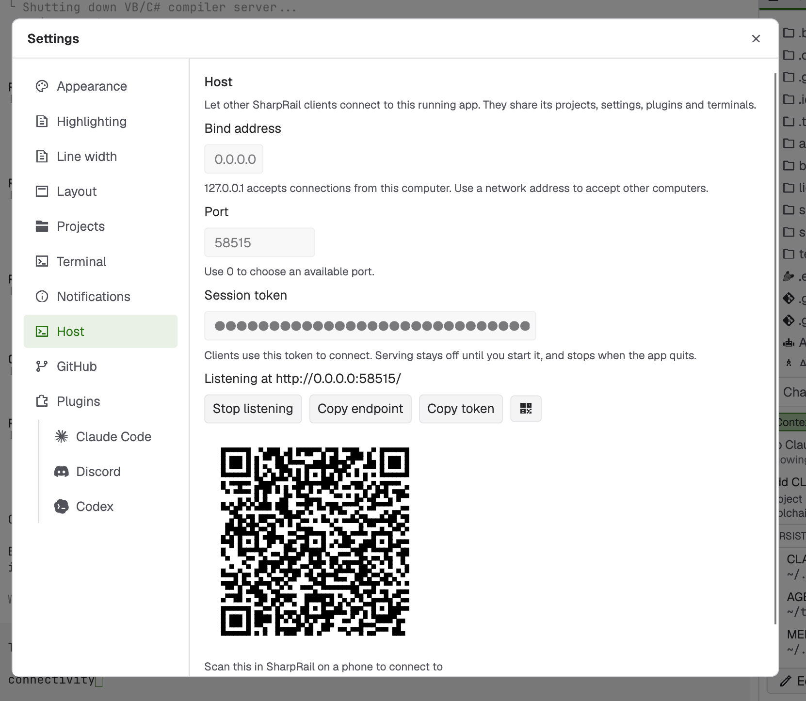

# SharpRail

SharpRail brings your projects, files, terminals and Git changes into one native
workbench. Keep a task in its own Git worktree, arrange the panes around the work,
and review what changed without leaving the app. It is a C# and Avalonia port of
[CommanderTvis’s ThinkRail fork](https://github.com/commandertvis/thinkrail),
with no browser, Electron shell or WebView.

Work on your own machine or connect to another one. Locally, the host runs inside
the app: file access, Git operations and terminal I/O stay in process, without a
separate workspace daemon or a network round trip. When you need remote development,
the same workbench connects to a host that keeps the projects and shells on that
machine. You get remote access without paying its transport overhead for local work.

## What you can do

- Keep separate tasks in separate Git worktrees. Create, switch, rename and remove
  workspaces from Project Home.
- Arrange tabs and split panes to suit the task. Open another window with ⌘⇧N;
  each window keeps its own layout, while projects and settings stay in sync.
- Read Markdown with tables, images, callouts and Mermaid diagrams, or edit its
  source. Review Markdown changes as rendered documents as well as source diffs.
- Edit text files with TextMate syntax highlighting in Scintilla and save with ⌘S.
- Review staged, working, branch and commit diffs, stage and unstage files, and use
  the Review panel to open a pull request or push updates to one.
- Run shells and terminal tools alongside your files. Enable the optional Codex
  and Claude Code plugins for workspace launchers, configuration and agent status.
- Choose a bundled theme, including high contrast, or follow the system with your
  preferred light and dark pair.
- Connect from the desktop or Android client to work with projects and terminals
  on a remote host.

SharpRail is still a prototype. The desktop editor and terminals currently target
macOS; Android provides editing and remote terminals through its own native backends.
Git diff views are read-only.
Completion, full IME preedit and accessibility text providers are not yet implemented. Codex and Claude Code run in terminals; there is no
built-in AI chat.

## Clients

The macOS desktop app can work directly with local projects or connect to a remote
host. It can also share its existing projects and shells with another client:
turn on the listener in Settings › Host. Each desktop window keeps its own layout.

The Android app connects to a host on another machine. Scan the QR code in the
desktop app’s Settings › Host to pair, or enter the address and token yourself.
Browse files, edit code, review changes and use the host’s terminals from a phone or tablet. Tablets keep
the desktop-style layout; phones put Projects, the current tab, Tools and Settings
on separate pages reached from a bottom bar. Your repositories and shell processes
stay on the host, so disconnecting the device leaves the work running there.
Android 7.0 or later is required, on arm64 or x86-64. Editing and live terminals
have been exercised in emulators; physical-device validation is still limited.

macOS and Android are the current client targets. Windows, Linux and iOS clients
are not yet supported end to end. There is no browser client. See the
[desktop run instructions](#run), [remote setup](#remote-projects) and
[Android build instructions](#android-client) below.

## Screenshots

The Android client uses the same projects and agent sessions as the desktop host.

| Agent tools on a phone | Remote agent terminal | Source editor |
| --- | --- | --- |
|  |  |  |

| Connect your phone to the desktop host |
| --- |
|  |

Scan the QR code from the Android connect screen to use the desktop host’s
projects, plugins and terminals.

## Plugins

Plugins add tools to the workbench and connect terminal agents to the workspace.
Turn them on or off in Settings › Plugins without restarting the app. SharpRail
ships these nine:

| Plugin | What it helps you do |
| --- | --- |
| Claude Code | Launch and resume Claude Code in a workspace terminal, inspect its instructions and settings, and follow its status through hooks and an IDE bridge. |
| Codex | Launch and resume Codex in a workspace terminal, inspect its instructions and settings, share editor context through `/ide`, and follow its hook status. |
| Specs | Browse a project’s spec graph and give terminal agents tools to read and maintain it. Projects without specs need no spec workflow. |
| Blueprint | Work through design choices in an interactive `BLUEPRINT.md`; a Claude Code or Codex author reconciles the document when you change a choice. |
| Git Graph | See branches, commits and worktrees together in a history graph. |
| Visualize | Let a terminal agent show a Mermaid diagram or compare options in a companion pane, then update that view as the discussion develops. |
| PDF Preview | Read PDFs alongside your code, with selectable text, zoom and refresh when the file changes. |
| File Icons | Recognize file types in the tree with Material Icon Theme icons. |
| Discord | Optionally share the project and file you have open through Discord Rich Presence. |

Claude Code, Codex and Discord start disabled; enable the ones you want. The agent
plugins integrate the external command-line tools, which must be installed on the
machine running the workspace. They bring agent sessions into the workbench without
adding a separate chat UI. Android includes the builtin plugin interfaces, although
plugin UI beyond the default workbench has not yet been verified on a device.

You can also install external managed plugins under `<stateDir>/plugins/<id>/`
or configure additional plugin paths. External plugins arrive disabled until you
choose to enable them. They can contribute side tools, launchers, file viewers,
icons, settings and MCP tools using the same API as the builtins. Plugin code runs
with the host or client’s permissions, so install plugins you trust. The
[Plugin API contract](src/SharpRail.Plugins.Api/SPEC.md) documents the extension
points and installation format.

## Hardware acceleration

The workbench renders through Skia on the GPU, including a custom Scintilla surface
for the editor. Ghostty’s Metal terminal textures are composed directly into that
same view, without copying frames back to the CPU; Skia provides a fallback.
Mermaid diagrams use Merman, a native Rust renderer, and display as vector SVGs
without a JavaScript engine.

Published .NET 10 builds start with precompiled code and tune hot paths as you work,
while keeping support for loading managed plugins.

## Run

From a source checkout. macOS builds need the Xcode command-line tools, LLVM at
`/opt/homebrew/opt/llvm`, and its Metal Toolchain
(`xcodebuild -downloadComponent MetalToolchain`). The first build downloads pinned
Ghostty 1.2.3, Zig 0.14.1, Scintilla, SheenBidi and Merman into `.tools`. No installed
Ghostty application is required.

```sh
scripts/bootstrap.sh
.tools/dotnet/dotnet run --project src/SharpRail.UI -c Release
```

To build the ReadyToRun macOS app bundle:

```sh
scripts/publish.sh
open artifacts/SharpRail.app
```

## Get started

Open a project using **+** in Projects or ⌘O (Ctrl+O on other platforms). A project
opens on its Project Home; create a workspace with ⌘N or work in the project folder.
In Files, click a folder's name to expand it, single-click a file to preview it, and
double-click or press Enter to keep a tab. Use Changes to review diffs. Save or
explicitly discard edits before closing a modified tab or window; failed saves keep the buffer, and files
changed on disk are never overwritten silently.

Each new workspace opens a terminal in the bottom panel; add more from a pane's +
menu. ⌘⇧J shows and hides the bottom panel, even from inside a terminal. Option acts
as Alt on U.S. layouts, as in Ghostty, so Option+Backspace deletes a word. ⌘V pastes
images as quoted file paths, saving PNG files under `~/.sharprail/clipboard`.
Quitting the app ends local shells.
You can change the terminal renderer in Settings without restarting your shells.
The reusable controls live in `src/Ghostty.Avalonia`; its README documents
the API, build requirements and limits of the Skia path.
If Metal texture rendering fails, the app switches to Skia and keeps the shell running.
Renderer benchmark sources and reproduction commands are in
[`benchmarks/ghostty`](benchmarks/ghostty/README.md).

## Checks

```sh
.tools/dotnet/dotnet run --project tests/SharpRail.Checks -c Release
```

`-- --editor`, `-- --terminals`, `-- --ghostty-skia`, `-- --sync` and `-- --workspaces` run focused
subsets. `sh scripts/check-terminal.sh`, `-- --native-terminal` and `-- --native-texture` exercise real
Ghostty windows and open test windows. Set `SHARPRAIL_TEST_GIT_SOURCE` to a Thinkrail
clone to include the Git fixtures. See `src/SharpRail.Scintilla/README.md` for the
editor control's architecture and limits.

## Remote projects

Your files, Git operations and shells run on the host machine; the client gives
you the workbench to use them. You can turn on hosting in the desktop app through
Settings › Host, or run a standalone host without keeping a desktop window open.
Local work continues to use direct calls even when the desktop app is listening
for remote clients.

To try the standalone host after publishing, start it and connect the app with the
same token. This example runs both on your own machine:

```sh
SHARPRAIL_TOKEN=your-token artifacts/host/SharpRail.Host.Remote
SHARPRAIL_REMOTE=http://127.0.0.1:54123 SHARPRAIL_TOKEN=your-token artifacts/SharpRail.app/Contents/MacOS/SharpRail.UI
```

For another machine, set the host's `SHARPRAIL_BIND` to its Tailscale IP and use that
address in `SHARPRAIL_REMOTE`. Remote connections use cleartext HTTP/2 and require an
encrypted network such as Tailscale. The host keeps its shared state in
`SHARPRAIL_STATE_DIR` (default `~/.sharprail/host`) and its terminal sessions until it
stops.

## Android client

The Android app is a client only: it shows the same workbench, while projects, settings, plugins and shells
stay on a host it connects to. It needs the Android SDK (`ANDROID_HOME`) and a JDK 17 or 21 (`JAVA_HOME`);
the script installs the .NET `android` workload and the pinned NDK into `.tools`.

```sh
scripts/android.sh run   # build, install on the connected device or emulator, and start
scripts/android.sh apk   # Release package at artifacts/android/SharpRail.apk
```

On the computer, start listening on an address the device can reach: Settings › Host in the desktop app, or
`SharpRail.Host.Remote` with `SHARPRAIL_BIND` as above. With the desktop listener, show its QR code in
Settings › Host and choose Scan QR code on Android to fill in the address and token. You can also enter
them manually (port 54123 when none is given). QR-code scanning has not yet been exercised on a device.
The app remembers both and connects by itself on the next launch; Settings ›
Host › Disconnect forgets the token. The connection is cleartext HTTP/2, so use an encrypted network such as
Tailscale. Requires Android 7.0 or later on arm64 or x86-64. Most validation has been on phone and tablet
emulators; a physical Pixel 8 has only been checked through installation and the connect screen.
See `src/SharpRail.Android/SPEC.md` for the design and limits.
