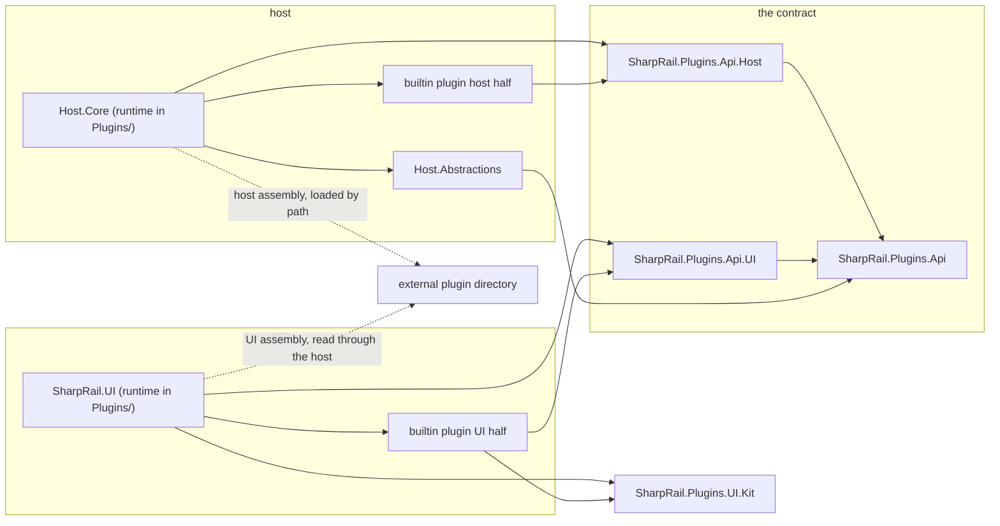
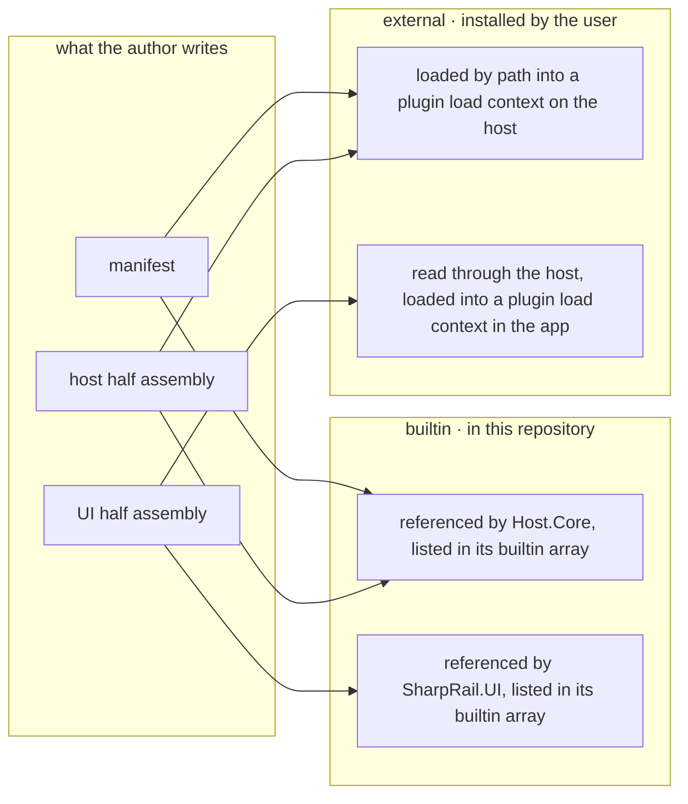
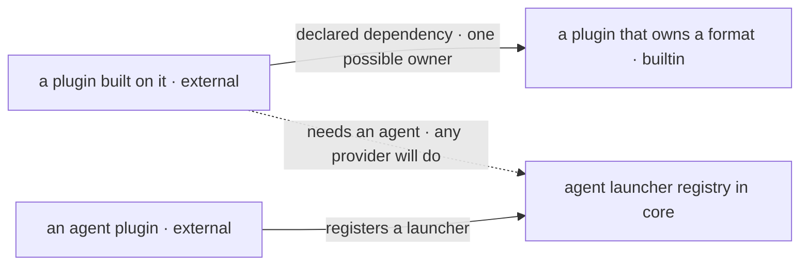
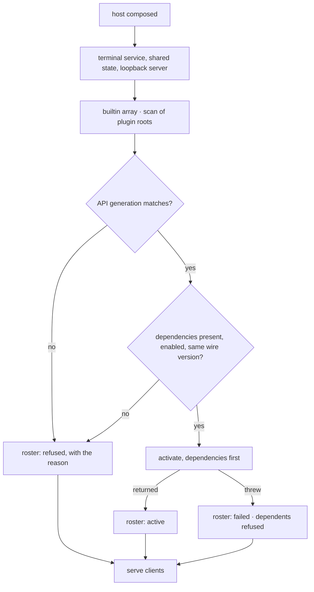
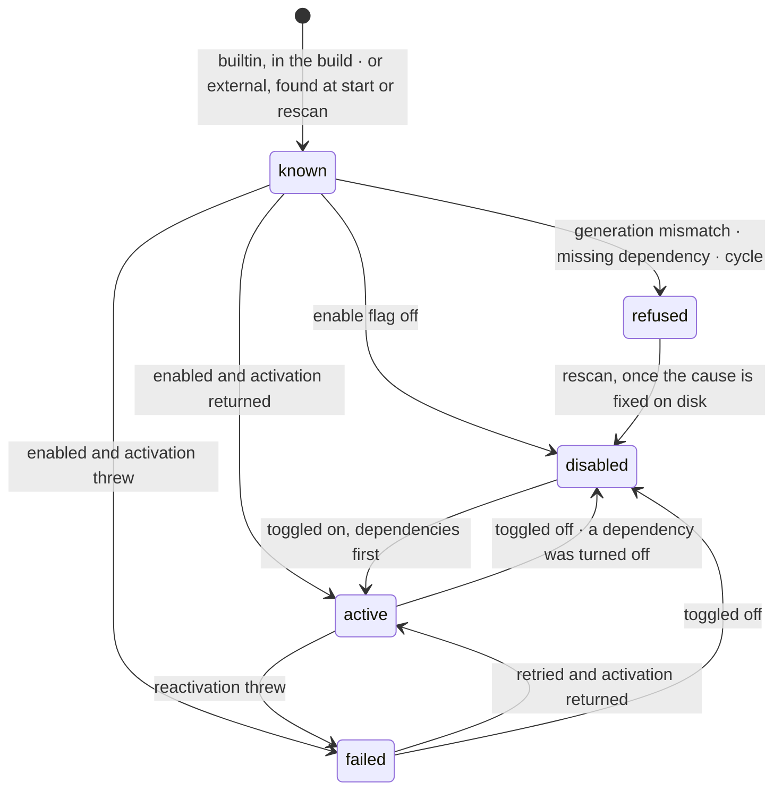
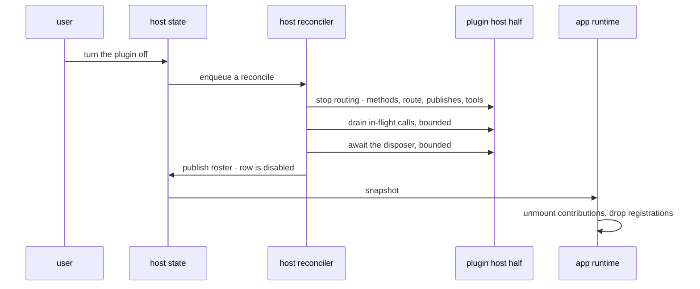
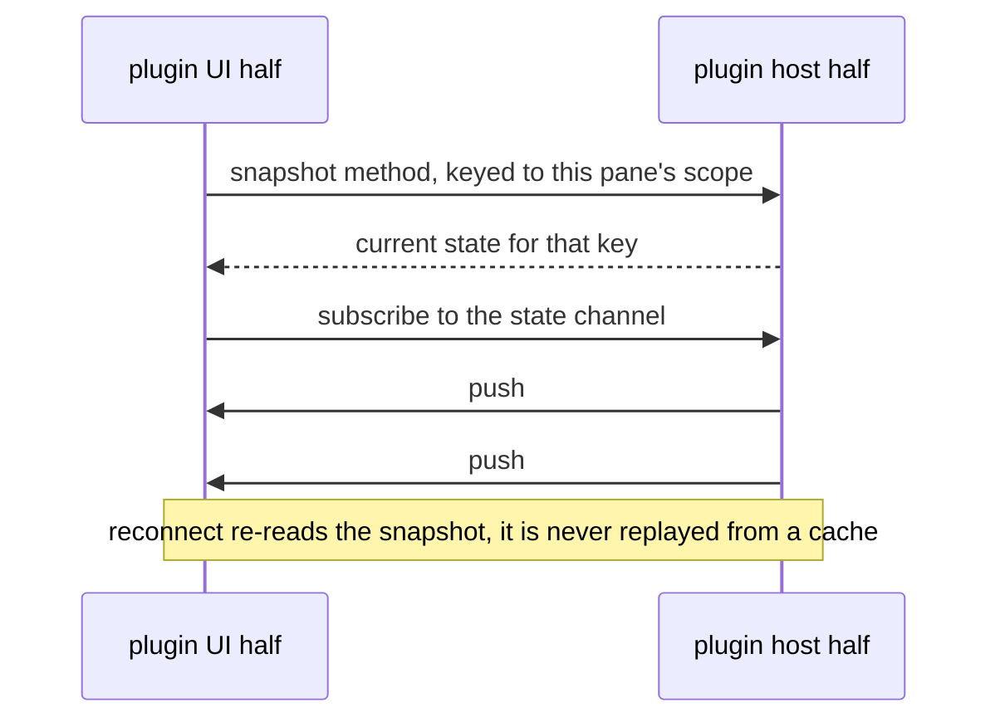
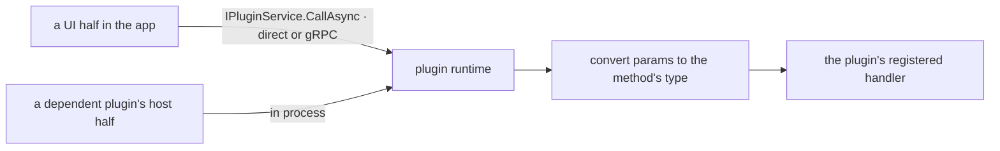

# Plugin API — the contract between the host, the app, and a plugin

Upstream: packages/plugin-api/SPEC.md @ 4737df6d (CommanderTvis fork)
Upstream: plugin-adoption.md @ 4737df6d (CommanderTvis fork)

A SharpRail feature currently reaches through every layer to exist: a method on a host interface, its Core
implementation, a wire contract, two adapters, an RPC class, a slice of `SharedState` or a window field, an arm
in a panel switch, and a row in several closed lists (`DockState.ToolNames`, the tool icon switch, the Settings
section list). This module is the contract that lets a feature live outside core instead. A plugin is a
manifest plus a host half, a UI half, or both. It owns wire methods and channels under its own namespace, and
can mount an HTTP route, stamp terminal environment, register MCP tools, observe host lifecycle, hold settings
and persisted state, and contribute a bounded set of UI surfaces.

A plugin is either builtin, a project in this repository referenced by the host and the app, or external,
owned by someone else and installed by the user as a directory of assemblies. Both get the same capabilities.
Every plugin can be turned on and off while the app runs, with no restart, which is a requirement rather than
an optimisation and is why the runtimes are built around it from the start.

The API is unstable, gated on a single generation integer, with no compatibility promise. What follows fixes
the boundary and the capability set. The builtin arrays start with the spec dialect; its Specs panel,
graph and MCP tools exercise the same API as external plugins. A fixture plugin in the checks
exercises the external path.

## Responsibility

The three API assemblies are the contract a self-contained feature is written against so that it can live
outside core. They contain types and a few identity helpers, and no runtime of their own. The runtimes live in
the layers that own the seams, `SharpRail.Host.Core/Plugins` ([Plugins.SPEC.md](../SharpRail.Host.Core/Plugins.SPEC.md))
and `SharpRail.UI/Plugins` ([Plugins/SPEC.md](../SharpRail.UI/Plugins/SPEC.md)), because only those may touch
the host services, the PTY, the shared state, or the workbench.

### When something should be a plugin

Existing extension points come first. An agent capability that needs nothing of SharpRail is an MCP server or
a tool in the agent's own configuration; it needs no SharpRail code. This API covers what such a tool cannot do
on its own: own host methods and channels, mount an HTTP route terminals reach, stamp terminal environment,
observe host lifecycle, hold settings and state, and contribute UI.

The distinction applies per capability, not per feature. A feature whose agent side is already portable can
still own a plugin for everything around it.

### Builtin and external plugins

A builtin plugin lives in this repository, ships inside the app and the remote host, and is updated in the same
commit that changes this contract. An external plugin is owned by someone else, released on their schedule,
and installed by a user.

Both declare the same manifest, receive the same capabilities, and appear in the same roster. Ownership affects
trust and lifecycle only: whether the manifest's default enablement is honoured, whether the API generation is
guaranteed to match, and what the user is told they are trusting. Delivery follows from ownership rather than
defining it.

Capability parity is deliberate. Most of the features this contract is measured against are external work, so
a capability restricted to builtin plugins would be unavailable to almost every consumer it has.

## Stability

This API carries no compatibility promise yet. There is no semantic versioning, no deprecation window, no
shims, and no commitment to keep a capability that stops being used. Any release may rename, reshape, or remove
anything described here, including the UI kit a plugin's UI is built against.

`PluginApi.Generation` records the shape a plugin was built against. It is declared in the manifest
(`ApiGeneration`), incremented with any breaking change, and checked before load. A mismatch is refused and
reported, rather than allowed to half-load and fail somewhere further from the cause. Builtin plugins are
updated alongside it; external plugins are expected to break on upgrade and are told so directly. Since any
upgrade can therefore disable somebody's plugin, the refusal names the plugin, the generation it declares, and
the generation the host is on, or it reads as the app quietly losing features.

Two guarantees do hold. The wire stays versioned per plugin (`WireVersion`), because a remote host and the app
ship independently. Persisted state stays readable across a generation change, because user data is not part
of the API.

### Recording the surface

No stability promise is not the same as no accounting. Every change to the plugin-facing surface has to be
visible in review.

Each of the four plugin-facing assemblies (the three API entries and the UI kit) runs
`Microsoft.CodeAnalysis.PublicApiAnalyzers` against a committed `PublicAPI.Shipped.txt` /
`PublicAPI.Unshipped.txt` pair listing every public symbol with its signature. Because warnings are errors, a
public symbol missing from the listing (RS0016) or a listed symbol that no longer exists (RS0017) fails the
build. Since nothing is shipped under a compatibility promise, every entry lives in `PublicAPI.Unshipped.txt`;
`Shipped` stays empty. `dotnet format analyzers <project> --diagnostics RS0016` rewrites the listing after a
deliberate change.

The listing is a record, not a veto: the gate makes a change impossible to land silently, and the reviewer
decides whether it is acceptable. One rule is written down for that judgement: removing a member, narrowing a
parameter, or widening a return is a breaking change and has to come with a generation bump. The checks pin
`PluginApi.Generation`'s value, so a breaking change fails them until someone bumps it deliberately.

## Boundary

- Owns: the contract vocabulary. A plugin declares one `PluginContract` naming its methods, channels, settings
  type and wire version. These assemblies own that shape, the manifest and roster shapes, the naming rules
  below, the tool shape, and the two context interfaces.
- Entries: three assemblies, with no reference between the host and UI entries.
  - `SharpRail.Plugins.Api` (root) carries what both halves and both runtimes share: `PluginApi`,
    `PluginIdentity`, `PluginManifest` and its parts, the contract vocabulary, `PluginJson`, the tool shape,
    the roster and agent-record records, `HostProject`/`HostWorkspace`/`HostPlatform`,
    `IPluginDependencyHandle` and `PluginCallException`.
    `HostProject.WorktreesDirectory` supplies the host-owned location for new worktrees, including remote
    hosts and custom state directories; plugins use it instead of deriving a path beside the checkout.
  - `SharpRail.Plugins.Api.Host` carries `IPluginHostContext`, `PluginHostModule` and the types its members
    use.
  - `SharpRail.Plugins.Api.UI` carries `IPluginUIContext`, `PluginUIModule`, `IPluginEditors` and the UI
    contribution types.
- Public surface: exactly the symbols in each project's `PublicAPI.Unshipped.txt`; the names table below lists
  the types.
- Allowed deps: the .NET base library for the root and host entries; the root entry, and Avalonia's `Control`
  types, for the UI entry.
- Forbidden: any `SharpRail.Host.*` or `SharpRail.UI` project, ASP.NET Core, gRPC or protobuf types,
  Avalonia in the root or host entry, and any runtime beyond identity helpers and name builders
  (`PluginJson.Convert` and `PluginTool<T>.RunAsync` are the two conversions they need). The UI kit is a
  separate assembly ([SPEC.md](../SharpRail.Plugins.UI.Kit/SPEC.md)), since controls here would make it a
  dependency of every host half.
- Dependents: `SharpRail.Host.Abstractions` references the root entry, because `HostState` carries the roster
  and agent records and `IPluginService` speaks in them; this is the edge the fork had in the other direction
  (its roster types lived in `contracts` and were re-exported). Records here are shared rather than mirrored in
  Abstractions so there is one definition.

### Reference documentation

Every public symbol of the three entries carries an XML doc comment: what it is for a plugin author, the rules
that bind it, and `<param>`/`<returns>`/`<example>` where they earn their place. `GenerateDocumentationFile`
makes a missing comment (CS1591) a build error. This is the one deliberate exception to the low-comment rule in
`AGENTS.md`: the readers are external plugin authors, who read the documentation their editor shows rather than
this spec. The spec stays the design record and the source of every rule; the comments are its per-symbol
reference, derived from it rather than duplicating its rationale. The kit is not enrolled in this rule.

### Names

| entry | types |
| --- | --- |
| `SharpRail.Plugins.Api` | `PluginApi`, `PluginIdentity`, `PluginManifest`, `PluginDependency`, `PluginPiBlock`, `PluginContributions`, `PluginSideToolContribution`, `PluginToolSide`, `PluginFileViewerContribution`, `PluginFileRead`, `PluginMethodSpec`, `PluginMethod<TParams, TResult>`, `PluginChannelSpec`, `PluginChannel<TPayload>`, `PluginChannelKind`, `PluginContract`, `IPluginDependencyHandle`, `PluginCallError`, `PluginCallException`, `PluginJson`, `TerminalRef`, `PluginToolContext`, `PluginToolResult`, `PluginToolDefinition`, `PluginTool<TParams>`, `PluginOrigin`, `PluginStatus`, `PluginRosterChannel`, `PluginRosterEntry`, `TerminalAgentRecord`, `HostProject`, `HostWorkspace`, `HostPlatform` |
| `SharpRail.Plugins.Api.Host` | `IPluginLogger`, `PluginDisposer`, `PluginCall`, `TerminalEvent` (`TerminalSpawned`, `TerminalExited`, `TerminalClosed`, `TerminalAgentChanged`), `TerminalProcess`, `RevivePrefill`, `WorkspaceEvent` (`WorkspaceCreated`, `WorkspaceUpdated`, `WorkspaceRemoved`), `WorkspaceFilesChanged`, `GitRunOptions`, `GitRunFailure`, `GitRunResult`, `PluginHttpRequest`, `PluginHttpResponse`, `IPluginHostContext`, `PluginHostModule` |
| `SharpRail.Plugins.Api.UI` | `IPluginUILogger`, `PluginDisposer`, `PluginAppSettings`, `TerminalTabInfo`, `PluginHostProjection`, `EditorKind`, `EditorRef`, `EditorSelection`, `EditorLifecycle`, `EditorEvent` (`EditorLifecycleEvent`, `EditorSelectionEvent`), `EditorOpenOptions`, `CompanionHost`, `TerminalKeyEncoding`, `ITerminalAccessoryApi`, `LauncherModel`, `LauncherCommandOptions`, `LauncherAvailability`, `AgentLauncher`, `FileIconKind`, `GitDiffScope` (`BranchDiffScope`, `UncommittedDiffScope`, `CommitDiffScope`, `PinnedDiffScope`), `TerminalOpenOptions`, `FilePickOptions`, `PluginNotificationKind`, `IPluginPreference`, `FileViewerProps`, `FileViewerRegistration`, `SettingsSectionRegistration`, `SideToolRegistration`, `CompanionRegistration`, `TabDecoration`, `TabRef` (`TerminalTabRef`, `ToolTabRef`, `FileTabRef`), `WorkspaceActionRegistration` (`WorkspaceScopedActionRegistration`, `ProjectScopedActionRegistration`), `TerminalAccessoryRegistration`, `IPluginEditors`, `IPluginUIContext`, `PluginUIModule` |

`IPluginLogger` and `IPluginUILogger`, and the two `PluginDisposer` delegates, are declared independently with
the same shape rather than shared, since the host and UI entries do not reference each other. The host disposer
returns a `ValueTask` (a toggle awaits it); the UI one is synchronous, as the fork's web disposer was.

An arrow means "may depend on". There is no edge from a plugin to any `SharpRail.Host.*` or `SharpRail.UI`
project, none between two plugins' host halves, and none from a UI half into the app's state, transport or
workbench.

### Names that are part of the contract

| what | shape |
| --- | --- |
| method and channel | `plugin.<id>.<name>` (`PluginIdentity.MethodName`/`ChannelName`); the generic call carries id and name separately |
| HTTP route | `/plugin/<id>/<subpath>` on the host's loopback HTTP/1.1 server (`PluginIdentity.Route`) |
| side-tool id in a layout | `plugin:<id>:<tool>` (`PluginIdentity.ToolId`/`ParseToolId`) |
| host settings | `HostState.PluginSettings[<id>]`, with `enabled` reserved to core |
| extra plugin roots | `HostState.PluginPaths` |
| host state files | `<stateDir>/plugin-state/<id>/<name>.json` (`PluginIdentity.StateFile`) |
| external plugin on disk | `<stateDir>/plugins/<id>/`, manifest `sharprail-plugin.json` (`PluginManifest.FileName`) |
| client-local preference keys | `plugin:<id>:<key>` (`PluginIdentity.PreferenceKey`), endpoint-qualified, in the profile |
| builtin plugin assets | `plugins/<id>/<assets>` under the app's and the remote host's output directory |
| core roster wire | `HostState.Plugins` on every snapshot; `IPluginService.ListAsync`, `RescanAsync`, `RetryAsync` |

`<stateDir>` is the host state directory: `~/.sharprail` for the app's own host, `SHARPRAIL_STATE_DIR` for a
remote host. An id is lowercase alphanumeric with hyphens. For an external plugin it must equal its directory
name, so the id cannot claim more than the user placed there. Code and state live in sibling trees, so
replacing a plugin does not disturb the state it wrote.

## What a plugin is

A plugin is a manifest plus a host half, a UI half, or both. A plugin with no host half is an ordinary case
rather than an exception.

### The manifest

`PluginManifest` is the same fields with two carriers: a builtin plugin constructs the record in code, and an
external plugin ships the same fields as `sharprail-plugin.json`, read with `PluginJson.Options` (camelCase
names and enum values, unknown members refused).

| field | meaning |
| --- | --- |
| `id` | the namespace for every name above; for an external plugin it must equal its directory name |
| `label` | shown in the roster, Settings › Plugins, and a dormant tool placeholder |
| `description` | optional one sentence, shown under the label in Settings |
| `icon` | a Remix Icon name, or `asset:<path>` naming an SVG under `assets`; an unknown name falls back to a generic glyph, which keeps the icons-only invariant without admitting arbitrary drawing |
| `version` | the plugin's own version, informational |
| `apiGeneration` | refused before load if it does not match `PluginApi.Generation` |
| `wireVersion` | incremented when the plugin's methods or channels change, so a separately shipped half can detect drift |
| `enabledByDefault` | honoured for builtin plugins; an external plugin always arrives disabled |
| `dependsOn` | other plugins, by id and exact wire version |
| `host`, `ui` | relative paths of the two entry assemblies; each holds exactly one public concrete `PluginHostModule` / `PluginUIModule` subclass |
| `assets` | optional directory the host hands the host half (`AssetsDirectory`) and serves to the UI half (`ReadAssetAsync`, W19), for either origin |
| `contributes` | the statically known parts: side tools with label, icon, default side and whether they need Git; file viewers with extensions, names and read strategy |
| `pi` | ThinkRail's agent block; parsed so a shared manifest reads, and ignored, since SharpRail has no in-process agent |

`contributes` exists because two rules below need a contribution to be known before any plugin code runs: the
file-open path picks a read strategy while restoring a window's tabs, before plugins activate, and the layout
has to name a side tool in order to render a dormant placeholder. Parts that need code, such as the control or
a finer predicate, are registered by the UI half during activation.

The fork's `styles` field has no counterpart: an Avalonia UI half carries its styles as compiled XAML inside
its own assembly.

### Delivery

Both paths hand the halves the same contexts. A builtin plugin is a set of projects (contract, host half, UI
half) under `src/`, with its own `SPEC.md`; its host half may not reference `SharpRail.Host.*`, and its UI half
may not reference `SharpRail.UI`, which project references make checkable rather than conventional. An external
plugin is a directory holding the manifest, the built assemblies with their own dependencies, and any assets.

### The shared UI runtime

A UI half cannot carry its own copy of Avalonia, the API or the kit, because two copies of an assembly in one
process are two sets of types: a `Control` from the plugin's copy is not a `Control` to the app. Three rules
follow, replacing the fork's window registry and stylesheet rules.

Every external plugin assembly loads into its own collectible-off `AssemblyLoadContext`. The context resolves
the shared assemblies (the .NET framework, Avalonia and its dependencies, SkiaSharp, the three API assemblies
and the UI kit) from the default context, so types unify, and loads everything else from the plugin's own
directory. A plugin's build references those shared assemblies without copying them (`Private="false"` /
`ExcludeAssets="runtime"`); a copy shipped anyway is ignored rather than loaded.

A plugin styles itself with the kit's brushes and fonts (`Ui`), which are what a theme change rewrites. A
plugin that writes literal colours will stop following theme changes, and nothing will report it.

The UI kit is a real assembly, `SharpRail.Plugins.UI.Kit`. It carries the primitives and the heavy shared
pieces: the Markdown renderer, the code editor frame, and the diagram view. It is the single home for the
primitives the app uses, and the app uses them from it, because two copies would drift. The theme catalogue
stays in the app; the kit owns the brush tokens a theme writes, which makes the token names a contract
documented in the kit's own spec.

### Trust

Discovery reads one directory, `<stateDir>/plugins`, plus any extra roots in `HostState.PluginPaths`. Projects,
worktrees, and repository checkouts are never scanned, so a cloned repository cannot place executable code in a
host. A plugin is code in the host process and in the app.

A discovered plugin is listed in Settings › Plugins as installed and off, with its label, version, any manifest
problems, and its declared contributions. Enabling it is the roster toggle and an explicit per-plugin action.
Nothing enables an external plugin automatically, including a project, a settings change from another client,
or an upgrade.

There is no sandbox. A host half runs in the host process with its privileges and without crash isolation,
and a UI half runs in the app. A fault can take down the host or the app, and a malicious plugin has access to
the user's machine. The trust model is the install decision plus the enable toggle.

### Depending on another plugin

One plugin may be built on another: a document format owned by one plugin, consumed by a second. That names one
specific plugin rather than a behaviour any provider could supply, and it is ordinarily a dependency across
ownership, external on builtin.

A dependency is declared in the manifest and grants three things.

- Presence and order. A plugin whose dependency is absent, disabled, failed, refused, or at a different wire
  version is refused, and the reason names the dependency. Activation runs dependency-first and disposal
  dependent-first in both runtimes. A cycle is refused at load.
- Types. The dependent may reference the dependency's contract project. For a builtin dependency that is a
  project reference; for an external one it is a copy of the contract the dependent's author vendors, where the
  wire version makes drift visible. Because payloads cross load contexts as JSON, two copies of a contract
  interoperate.
- Calls. The dependent may invoke the dependency's declared methods and subscribe to its channels through
  `Dependency(contract)`. In the app this is the ordinary plugin call path. On the host the runtime dispatches
  in process.

A dependency grants nothing beyond those three. It does not reach the other host half, share objects, or
register into the dependency's surfaces. The grant is wire-level, so it does not cover a synchronous
render-time provider in the app; those are registered into a core slot instead, which is how one plugin's file
icons reach another plugin's file picker without a plugin-to-plugin edge.

A plugin cannot be enabled while a dependency is off, and the Settings toggle offers to enable both. Turning a
dependency off also turns off its dependents, which are named first. Turning it back on does not re-enable them,
since the user decides what runs.

Dependencies make one plugin's failure into another's, and a dependency chain is a load-order constraint in a
system that otherwise has none. Two edges are manageable. A third is the point to ask whether the shared part
belongs in core instead.

Where several plugins could satisfy a need, a core contribution point is preferable to a dependency. A feature
that needs an agent to author with, where any agent plugin would do, goes through the launcher registry (W9). A
feature that needs one specific plugin's format declares a dependency. The test is whether the need names a
capability or a particular plugin.

### Allowed dependencies of a plugin

A host half may depend on the root and host entries, a dependency's contract, and exact-pinned third parties.
It may not depend on any `SharpRail.Host.*` project, `SharpRail.UI`, or another plugin's host half. Git goes
through `GitAsync`; everything else a host half needs (sockets, files, processes) is ordinary .NET.

A UI half may depend on the root and UI entries, the UI kit, Avalonia, a dependency's contract, and its own
third parties. It may not reach the app's state, transport, workbench or panels. It reaches the app through the
UI context alone, which is what allows it to live outside this repository.

## Enforcement

1. Project references are the boundary. The API projects, the kit and each builtin plugin's projects reference
   only what this spec allows, and `SharpRail.slnx` holds them all, so an illegal edge is a missing reference
   and a build error rather than a review comment.
2. The public-API listings and `GenerateDocumentationFile` (see Stability) fail the build on an unlisted or
   undocumented public symbol.
3. The checks pin `PluginApi.Generation`, load the fixture plugin from a temporary plugin root, and assert that
   a shared assembly shipped in a plugin directory is not loaded a second time.
4. Plugin checks live in `tests/SharpRail.Checks` beside the other host and UI checks; the fixture plugin's
   projects live under `tests/` and build into a plugin directory the checks install from disk, since that is
   the path almost every plugin in scope takes.

## Loading, composition, the enable gate

Builtin plugins are composed statically in both runtimes: a literal array of host halves in
`SharpRail.Host.Core/Plugins/BuiltinPlugins.cs`, and a literal array of manifest plus UI half in
`SharpRail.UI/Plugins/BuiltinPlugins.cs`. Both begin with the spec dialect plugin.

External plugins are discovered and then loaded from disk. When the host starts, it lists `<stateDir>/plugins`
and every root in `HostState.PluginPaths`, reads each manifest, and refuses an id that does not match its
directory or an API generation that differs. For each enabled plugin it loads the host assembly into a plugin
load context and serves the UI assembly, its sibling assemblies and any assets through the plugin file read. A
manifest that does not parse, a missing entry, an assembly without exactly one module type, or a throwing load
marks the plugin failed or refused with its reason, and the host continues.

Extra roots are host state rather than a separate file, so they are validated, broadcast, and editable from
Settings like anything else, and a plugin found in one still arrives disabled.

`HostState.PluginSettings[<id>].enabled` is owned by core inside the plugin's own namespace. A settings type may
not declare `enabled`, so there is no second private toggle. Under a roster gate, a plugin-private toggle would
unmount the section the user is standing in.

The host's plugin runtime is created where the host is composed (the app's `App.cs` for its own host,
`RemoteServer.Create` for a remote one), after the terminal service, the shared-state store and the loopback
server exist, and before the first client can call. Within that window the order is topological by declared
dependency. A throwing activation is caught, the plugin is marked failed, its dependents are refused with that
as the reason, and the host continues. Deactivation is the first step of host shutdown.

A disabled plugin is inert rather than absent: methods answer `PluginCallError.Disabled`, its route returns
404, environment contributors and tools are skipped, and publishes do nothing. Channels are the exception: a
subscription to a known plugin's channel stays open across disable and enable, so a client never has to notice
a toggle to keep receiving.

Discovery is a read rather than a watch. It runs at host start and on an explicit rescan from Settings, so
installing a plugin does not need a restart either, but nothing watches the directories: a watcher over
executable code would reload on every partial write.

UI activation runs from the app's plugin runtime once the workbench has its host. Each plugin whose roster row
is active and whose wire version matches is loaded, from the builtin array or through the host, and activated.
Manifests from the roster are always known, so a persisted `plugin:<id>:<tool>` tab can render "*label* is off"
with the correct label and icon before any assembly loads.

Teardown runs in reverse: plugins dispose first, and dependents before the plugins they depend on.

Settings › Plugins is a single section in core. It lists every roster row, builtin and external alike, with
label, description, icon, version, origin, toggle, declared contributions, and the reason for a failed or
refused row. It is the only place a plugin is turned on, and the only place a generation mismatch is
explained.

Every transition is live and publishes the roster. None of them requires a restart, including recovery from
`failed` and from `refused`.

## Enabling and disabling at runtime

Every plugin can be turned on and off while the app runs. There is no restart of the host and no restart of the
app, for builtin and external plugins alike.

### One reconciler, not a toggle handler

Desired state is `HostState.PluginSettings[<id>].enabled` over the set of known manifests. Actual state is what
the runtime currently has activated. A single reconciler converges the two and then publishes the roster, and
every event that can change either side goes through it: host start, a settings change, a dependency cascade, a
retry, and a rescan. There is no separate toggle path to keep in step with the start path.

The reconciler is serialised, one run at a time per host. A settings change enqueues a run rather than acting
inline, so two rapid toggles collapse into one convergence on the final desired state rather than racing. A run
computes the target set, then walks it in dependency order.

### Activation ids

Each activation of a plugin receives a monotonically increasing activation id, unrelated to the API
generation. Every registration and every callback the runtime hands out closes over that id, and anything
arriving from a stale activation is dropped. This is what makes a toggle safe against work already in flight: a
late publish from a disposed activation cannot reach a client, and a timer the plugin forgot to stop cannot
resurrect it. Hot disable is only as correct as the drain and these ids, so a publish or a timer escaping a
disposed activation is the case the checks have to cover.

### Disabling, host side

Disabling happens in three steps, in this order.

Routing stops first. Methods answer the disabled error, the route returns 404, publishes become no-ops,
environment contributors are skipped for future shells, and the plugin's tools leave the MCP table.

Then in-flight work drains. The runtime counts method calls, route requests, and tool runs belonging to the
current activation, and waits for that count to reach zero before tearing anything down, bounded by a timeout
after which it proceeds and logs. This keeps a tool call that is already executing from losing its state
underneath it.

Then the disposer runs. On a toggle the runtime awaits it, bounded, because a plugin with a second listener has
to close it. On host shutdown the disposer is started and not awaited. That difference is the only asymmetry
between the two teardown paths.

Persisted state is untouched. The plugin's settings namespace and its state files stay exactly as they were, so
turning a plugin off and on again is not a reset.

### Enabling, host side

The assembly is loaded if it is not already resident, then activation runs and its registrations take effect
immediately. If activation throws, the row becomes `failed` with the reason, desired state stays on so the user
can see that it is enabled and broken, and the Settings row offers a retry that triggers another reconcile.

### The app runs the same reconcile

The roster is the contract between the host and the app. The app's runtime treats the roster on each
`HostState` snapshot as desired state, and the set of activated UI halves as actual state. Reconnecting after a
dropped connection is therefore not a special case.

Disabling unmounts a plugin's contributions and drops its registrations. It does not unload the assembly: load
contexts are not collectible here, so re-enabling re-activates without loading anything again and the memory
is not reclaimed. A user toggling repeatedly pays for each updated version they load.

One rule makes this safe in Avalonia: every contribution's control is created by the plugin's factory inside a
host control the runtime owns per plugin and per mount, and removing a plugin removes those host controls, so
nothing a plugin created outlives its mount and no core control holds a plugin control directly.

### Open resources when a plugin leaves

A side tool tab keeps its place in the layout and renders the dormant placeholder, so the frame is not
rearranged by a toggle and the tab is live again when the plugin returns. A companion pane collapses. A file tab
whose viewer has gone shows a placeholder offering to open the file as text, because a viewer with a read
strategy of none never had its content read. A request already in flight to a departing plugin fails with the
disabled error, which the runtime treats as expected during teardown rather than surfacing it as a failure.

### What is hot, and what is not

Enabling and disabling are hot for every plugin. Installing is hot after a rescan. Updating a plugin in place
is hot as well: both runtimes key a plugin's load context by the content hash of its entry assembly, so changed
bytes load into a new context; the previous context stays resident, which is the cost of not restarting.

Two things are deliberately not hot. A running shell keeps the environment it was given at start, since there is
no way to restamp a live process, so a plugin's environment contribution reaches only shells started after it.
And a tool call already executing finishes against the activation that started it, which is what the drain step
exists to allow.

## Wire

A plugin declares one `PluginContract`, built with `PluginContract.Create`, that the host half hands to the
runtime: `PluginMethod<TParams, TResult>` and `PluginChannel<TPayload>` values, a settings record type, and a
wire version. The typebox schemas of the fork become C# records; the fork's `MethodParams`, `MethodResult`,
`ChannelPayload` and `PluginSettings` projections become the type arguments of those descriptors, so a call is
typed from the descriptor it names. What the UI half needs at runtime beyond its descriptors (a channel's kind,
its snapshot method, its key fields, and the wire version to check against) travels on `PluginRosterEntry`
(`Channels`, `WireVersion`), built by the host from the contract it has loaded. The app's runtime reads channel
behaviour from the roster rather than from a UI half's descriptor, and compares a builtin UI half's manifest
`WireVersion` against the roster's; an external UI half is trusted, since its assembly and the manifest that
produced the roster row come from the same plugin directory.

Method and channel names are `plugin.<id>.<name>`. The core wire gained the roster once; after that a plugin's
changes move only its own wire version. A UI half whose version differs from the host's stays dormant with that
as its reason, which matters most when the two halves can be updated separately.

There is one generic method and one generic stream, not a gRPC service per plugin: `IPluginService.CallAsync`
(plugin id, method name, params → result) and `IPluginService.SubscribeAsync` (plugin id, channel name, optional
key → payloads). Over gRPC the params, results and payloads are JSON bytes written with `PluginJson.Options`. In
the app's own host the call is direct, with no serialization, as with every other host service: params and
results stay objects, and `PluginJson.Convert` turns a value into the declared type, passing an instance of
that type through untouched and converting anything else (a JSON element from the wire, or an equivalent type
from another load context) through JSON.

A state channel names a snapshot method and its key fields, mapping the channel's scope onto that method's
params. This is architecture Decision 8 expressed in types: a channel keyed per workspace or per terminal needs
a keyed snapshot, which a param-less rule would not cover. The snapshot method returns either one payload or
a list of payloads (for example, all terminal states in a workspace), enforced by the two
`PluginChannel<TPayload>.State` overloads. List snapshots hydrate subscribers one payload at a time.

An event channel is documented as lossy and has no snapshot. It exists for host-to-client requests that time
out on their own. Plugin channels are never replayed.

Params are validated at dispatch. Over the wire, validation is strict deserialization into the method's params
record with `PluginJson.Options`: required constructor parameters, nullable annotations and unknown members are
all enforced, and a failure is `PluginCallError.InvalidParams` naming the offending JSON path. In process, the
params are already an instance of the declared type and the type system is the validation. Results and channel
payloads are not validated per message.

`PluginCallException` carries one `PluginCallError` (`Unknown`, `Disabled`, `InvalidParams`, `Failed`) the same
way locally and remotely; a client behaves differently only for `Disabled`, and learns enablement from the
roster.

The one-time core edit covers: `IPluginService` in `Host.Abstractions` and its gRPC contract; the roster,
`PluginSettings`, `PluginPaths`, `TerminalAgents` and `Platform` on `HostState`, with the `plugin-settings`
and `plugin-paths` changes; and the `plugin:` tool ids the layout accepts. Carrying label, icon, and
contributions on the roster is what lets the app know an external plugin's contributions without loading its
code. Status alone encodes enablement.

A plugin's declared methods have one implementation and two callers: the app, through `IPluginService`, and a
dependent plugin's host half, in process.

The roster follows hydrate-then-stream. Every `HostState` snapshot carries it, `IPluginService.ListAsync`
reads it at any time, and the host publishes a snapshot after every activation, disposal, and failure. Runtime
status rides the snapshot, not the settings, because a client that never witnessed a toggle still has to be
able to read it.

## Host capabilities

The host context is passed to `PluginHostModule.ActivateAsync`, which may return a disposer. Every registration
is recorded by the runtime and torn down on dispose, so a plugin keeps no cleanup bookkeeping of its own. The
set is closed.

| # | capability | seam it replaces |
| --- | --- | --- |
| H1 | register a request method, with validated params and the calling client's key (`Method`) | every host operation is a hand-written method through Abstractions, Core, Protocol and both adapters |
| H2 | publish on a declared channel, optionally addressed to one client (`Publish`) | `IHostStateService.WatchAsync` is the only push the host has |
| H3 | mount an HTTP route under `/plugin/<id>/` on the loopback server, read its base URL (`Route`, `PublicBaseUrl`) | `McpRoute`'s loopback server serves only `/mcp/{token}` |
| H4 | register a tool on the per-terminal MCP surface (`Tool`) | The spec dialect registers all seven `spec_*` tools; core owns only MCP routing |
| H5 | contribute shell environment, computed per terminal (`TerminalEnvironment`) | `PtyTerminalService.ShellEnvironment` sets a fixed set of variables |
| H6 | mint and resolve a per-terminal identity token (`TerminalToken`, `TerminalForToken`) | the MCP token is private to `PtyTerminalService` |
| H7 | read and write a typed agent record per terminal, persisted, broadcast, dropped on close (`AgentRecord`, `SetAgentRecord`) | a terminal session carries no agent field |
| H8 | observe terminal lifecycle: spawned with pid, exited, closed, agent changed; list terminals; map a process to its workspace (`OnTerminal`, `Terminals`, `WorkspaceForProcess`) | none |
| H9 | offer optional text and a submit flag when a shell starts again for a tab with an agent record; compose the first text and all submit flags, delivered with the attachment (`RevivePrefill`) | none; restored tabs start fresh shells |
| H10 | write into a terminal host-side, bypassing client attachment (`WriteTerminal`) | `ITerminalSession.WriteAsync` ignores a detached client |
| H12 | read projects and workspaces, watch a workspace, observe lifecycle and filesystem-change batches (`Projects`, `WorkspacesAsync`, `WorkspaceAsync`, `WatchWorkspaceAsync`, `OnWorkspace`, `OnFilesChanged`) | `HostState.Projects`/`Workspaces`; the only watcher is a window's local `WorkspaceWatcher` |
| H13 | read its own settings namespace and observe changes (`Settings<T>`, `OnSettings<T>`) | `HostSettings` is closed |
| H14 | read and write namespaced JSON state under the state directory (`ReadState`, `WriteState`) | `HostStateStore`'s file is private to it |
| H15 | a logger, its own assets directory, activation and a disposer awaited on a toggle (`Log`, `AssetsDirectory`) | none |
| H17 | run Git in a project or workspace through the host's bounded runner (`GitAsync`) | `GitRepository`'s runner is internal to `Host.Core` |
| — | expose exact absolute files outside the worktree for core text editing (`ExternalFiles`) | file reads and saves are confined to the workspace |

H11 (send text to an agent session) and H16 (contribute agent extensions and skills) are not ported: SharpRail
has no in-process agent. The fork's H12 `suggestWorkspaceName` is not ported either, since SharpRail has no
workspace auto-naming to feed.

Git is a capability rather than something a plugin spawns for itself, which is the one exception to the rule
that a host half is ordinary .NET code. The host's runner already disables terminal prompts, bounds every child,
and sets `GIT_OPTIONAL_LOCKS=0` so a host read is never mistaken for a repository change by a watcher; a plugin
re-deriving those would reintroduce the loop that rule prevents.

Several things are deliberately absent. There is no whole-host-state read, since no feature reads core's or a
sibling's namespace once settings are namespaced, and reading a sibling's namespace directly would bypass the
declared-dependency rule. There is no raw state-directory path, since H14 covers persistence. There are no
dialog, process, or filesystem wrappers, no generic event bus, and no core agent-kind framework.

Per-client addressing in H1 and H2 exists for one case: a bridge that reports per-client editor facts and has to
answer the client that owns a terminal. A client key names one app instance connected to the host (the app's
own host has one). Broadcasting such an action to every client assumes their layouts agree, which is not true
under architecture Decision 9. A plugin channel may therefore carry per-client facts as reports tagged with the
reporting client, but never as authority installed on another client, and an action is addressed rather than
broadcast.

A tool is declared once: name, label, description, a parameters record, and a run function receiving the
resolved working directory, the workspace and the owning terminal. The runtime adds it to the per-terminal MCP
table bound to the token owner, deriving the input schema from the parameters record and validating arguments
by strict deserialization. The fork's agent surface and prompt snippet are not ported, since they adapted a tool
to pi.

## UI capabilities

| # | capability | seam it replaces |
| --- | --- | --- |
| W1 | request its methods, subscribe to its channels, read a keyed snapshot on subscribe and reconnect (`RequestAsync`, `Subscribe`) | `SharedState` is the only subscription the app holds |
| W2 | read and write its own settings namespace (`Settings<T>`, `OnSettings<T>`, `UpdateSettingsAsync<T>`) | `HostStateChange.Setting` names a closed set |
| W3 | read a projection: projects, workspaces, active workspace, context project, active editor, applied settings, terminals, shown terminals, per-workspace file revision, roster, host platform; synchronously (`Host`) or observed by selection (`WatchHost`) | window fields and `SharedState` |
| W4 | contribute a Settings section (`SettingsSection`) | `SettingsWindow`'s fixed section buttons |
| W5 | contribute a side tool under `plugin:<id>:<tool>`, declared in the manifest, rendered by the UI half (`SideTool`) | `DockState.ToolNames`, `DockState.ToolRegion`, the tool body switch in `WorkbenchWindow`, the tool icon switch in `DockGroups` |
| W6 | contribute an embedded companion pane beside a terminal, and focus it (`Companion`, `FocusCompanion`) | none |
| W7 | register a file viewer: extensions, names and read strategy from the manifest, control and finer predicate from the UI half, optionally handling the open outright (`FileViewer`) | the open path picks text, Markdown or image by extension |
| W8 | decorate a tab with an icon or adornment (`TabDecoration`) | the tab icon switch in `DockGroups` |
| W9 | register an agent launcher, and enumerate registered launchers (`Launcher`, `Launchers`, `OnLaunchersChanged`) | the create-workspace flow starts no agent |
| W10 | contribute a workspace-level or project-level action (`WorkspaceAction` with `WorkspaceScopedActionRegistration` or `ProjectScopedActionRegistration`) | the workspace's start actions are fixed; a project-scoped one renders on Project Home |
| W11 | contribute a terminal accessory row that can write, read the buffer tail, set key encoding (`TerminalAccessory`) | `TerminalView` owns the Ghostty view |
| W12 | observe editor events; open (optionally bypassing every viewer, `Raw`), close, list, check, save editors; report a selection into the editor-event stream (`Editors`) | no editor events exist |
| W13 | open or select a terminal tab, enter a project's Default workspace, ask for a file or folder (`OpenTerminalAsync`, `EnterDefaultWorkspaceAsync`, `PickFileAsync`) | layout and navigation calls private to `WorkbenchWindow` |
| W14 | read a worktree file's bytes, observe its revision, keep the workspace watched (`ReadFileAsync`, `FileRevision`, `ObserveFileRevision`, `WatchWorkspaceAsync`) | `IProjectServices.ReadContentBytesAsync` per window; `WorkspaceWatcher` is private |
| W15 | observe reconnection and workspace removal (`OnReconnect`, `OnWorkspaceRemoved`) | `SharedState.ConnectionChanged` and `HostSync` |
| W16 | reveal a tool by id (`RevealTool`) | `LayoutSession.RestoreTool` is reachable only inside the workbench |
| W17 | contribute a file-icon resolver, consulted wherever core renders a file (`FileIconSlot`) | `Ui.Icon("file")` and the tab icon switch; Files and Changes rows carry no file-type icon |
| W18 | scope the Changes panel to a commit, the uncommitted tree, or a comparison target (`SetDiffScope`) | the scope is private to `GitPanels` |
| W19 | read a file under the manifest's declared `assets` directory (`ReadAssetAsync`) | a plugin with no assets throws rather than guessing a path |

W17 is unoccupied in this commit; core's generic glyph is the fallback when no plugin answers. The
`DocumentLinkSlot` is consulted the same way when a rendered document's link is followed.

The fork's chat parts are not ported: chat companion hosts, `openChat`, tool renderers and the
`writtenPathGroup` slot all serve the AI chat SharpRail excludes.

Some contributions are excluded. There is no state-slice contribution, since a plugin owns its own state.
There are no plugin centre-tab kinds. There are no layout-mode, drop-target, context-menu, or group-metadata
contributions, because layout modes stay in the app. Viewer and decoration ordering is registration order,
first non-null wins. A dormant plugin's tool tab keeps its slot. No layout-arrangement verb is offered at all
(architecture Decision 5). W3 is a read projection rather than the app's state: no raw file-change map, which W14
covers, and no actions bag.

W5 needs a catalog seam rather than just an id pattern. Tool name, default side, icon and restore order are
closed in `DockState`/`DockGroups`, and the docking layer may not reference features. The catalog therefore
becomes an input of the layout, threaded through name lookup, tool-tab construction, the unplaced-tool menus,
and preset restore, and built by the workbench from core's tools plus the roster's declared side tools. Without
it a `plugin:` id validates, renders an empty name, and never appears in a reveal menu.

Tool controls and workspace actions are retained per window and workspace. An optional W5 `Retarget`
callback can reuse a control across workspaces sharing its data scope; returning false leaves it unchanged.
Plugin removal, project/workspace closure, appearance changes and window closure release retained controls.

Editor events come from one emitter in the app's plugin runtime, fed by the Scintilla editor and the Markdown
preview, so nothing in the editor needs to know an IDE bridge exists.

`Editors.OpenAsync` accepts a JSON `KeyPath` to reveal a declaration in the editor's current contents. It takes
precedence over `Line`; an unresolved key opens at the top. The editor owns resolution so unsaved changes cannot
make a plugin's cached line number stale. `Raw` bypasses the viewer dispatch entirely, for a plugin whose own
viewer needs an escape hatch back to the file's text. `Editors.ReportSelection` feeds a selection into the same
stream the editor and the preview report through, so a plugin's own rendered document reaches an IDE bridge the
same way selecting code does.

### Avalonia in place of React

The fork's web context was shaped by React; these are the reshapes that framework forces, and nothing else.

- A component becomes a factory returning a new `Control` per mount (`Func<…, Control>`), because an Avalonia
  control has one parent. The runtime places it in a host control it owns per plugin and per mount.
- An icon component becomes an icon name (a Remix name or `asset:<path>`), resolved like the manifest's, because
  a single control instance cannot appear in several places.
  Launchers additionally offer `CreateIcon(size, color)` for consumers in another plugin: its factory
  retains the owning plugin's asset reader and returns a fresh control at the requested size and tint.
- Hooks (`useHost`, `useSettings`, `useLaunchers`, `editors.useActive`, `useFileRevision`, a companion's or
  launcher's `useAvailable`/`useTitle`/`useModels`) become a synchronous read plus an observer returning
  `IDisposable`, or a predicate the runtime re-evaluates on `Invalidate()`.
  Launcher observers also fire on invalidation so availability and model reads remain current.
- `fileUrl` and `assetUrl` become byte reads (`ReadFileAsync`, `ReadAssetAsync`), since there is no browser to
  fetch a URL.
- `patchSettings(partial)` becomes `UpdateSettingsAsync<T>(settings)`, merged field by field into the
  namespace, since a record `with` expression is the C# partial update.

## Settings, persistence, client-local state

`HostState.PluginSettings` is merged per namespace, two levels deep: a `plugin-settings` change touches only
its own id, merging its JSON object's members into that namespace, and an empty value resets the namespace.
This matters because the obvious whole-map update would delete every other plugin's namespace, reset their
enablement to manifest defaults, and make the host dispose them. A check writes two namespaces in sequence and
asserts that both survive.

Each touched namespace is validated against its plugin's settings type with defaults filled before it is
persisted and broadcast. An invalid namespace rejects the whole change batch, matching the existing
all-or-nothing rule. An invalid namespace found when the store loads falls back to defaults with one warning.
A namespace for a plugin whose host half has not loaded yet is stored unvalidated and validated from its next
write.

The app never writes settings locally. A change is sent and the value changes when the snapshot carrying it
arrives, so the initiating client converges like any other.

Host persistence is namespaced under the state directory and survives the plugin being replaced. Facts scoped to
a terminal live in its agent record instead, so the shell's lifecycle stays with core.

Client-local preferences live in the profile under an endpoint-qualified key. Companion visibility is
per-window view state (architecture Decision 9). Nothing plugin-local crosses the wire.

Persisted layout tolerates unknown values. Tool-id validation accepts the `plugin:` pattern, and a tab naming a
tool from a plugin the user has since removed keeps its slot as a dormant placeholder rather than invalidating
the layout.

## Out of scope

Contributing into another plugin's surfaces, and cross-plugin UI composition; optional dependencies and version
ranges; any registry, marketplace, installer, updater, or signature check, since installing is a copy into a
directory; sandboxing or crash isolation; unloading a disabled plugin's assemblies; compatibility shims for an
older generation; plugin centre-tab kinds, layout intents, and layout modes; plugin-defined theme tokens; a host
event bus; core agent-kind detection; a generic settings form rendered by core, since a plugin has the kit and
can ship a real section; native menu contributions; runtime validation of results and pushes; and an
external-file tab kind beyond the exact-file allowlist below. Everything agent-side: pi, the agent tool surface,
agent extensions and skills, chat, and their capabilities (H11, H16, chat hosts, tool renderers).

## External configuration files

`IPluginHostContext.ExternalFiles(provider)` registers a synchronous, workspace-scoped list of absolute paths the
plugin exposes for text editing. The host checks current providers on every absolute file read or save; only
active registrations count. This is an exact file allowlist, not directory access. Plugins own discovery; core
owns reading, compare-and-swap saves, editor buffers, and restoration.

## Public surface

`PluginChannel`, `PluginMethod`, `PluginTool`, `HostPlatform`, `HostProject`, `HostWorkspace`, `IPluginDependencyHandle`, `PluginApi`, `PluginCallError`, `PluginCallException`, `PluginChannelKind`, `PluginChannelSpec`, `PluginContract`, `PluginContributions`, `PluginDependency`, `PluginFileRead`, `PluginFileViewerContribution`, `PluginIdentity`, `PluginJson`, `PluginManifest`, `PluginMethodSpec`, `PluginOrigin`, `PluginPiBlock`, `PluginRosterChannel`, `PluginRosterEntry`, `PluginSideToolContribution`, `PluginStatus`, `PluginToolContext`, `PluginToolDefinition`, `PluginToolResult`, `PluginToolSide`, `TerminalAgentRecord`, `TerminalRef`.
